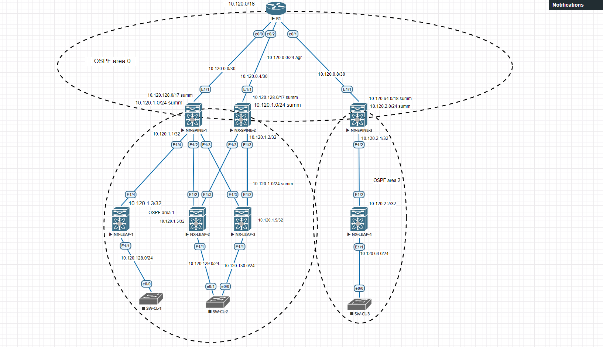

# Underlay OSPF

Адреса и сети в проекте:

| Пул ip адресов | Назначение | Маска сети |
| ------ | ------ | ------ |
| 10.120.0.0/16 | Общий пул ip адресов | /16 |
| 10.120.0.0/24 | P2p-соединения Spine - Core| /30 |
| 10.120.1.0/24 | Пул адресов Loopback-интерфейсов для unnumbered p2p-соединений Spile - Leaf ЦОД 1 | /31 |
| 10.120.2.0/24 | Пул адресов Loopback-интерфейсов для unnumbered p2p-соединений Spile - Leaf ЦОД 2 | /31 |
| 10.120.128.0/17 | Общий пул ip адресов для клиентских сетей на Leaf ЦОД 1 | /24 |
| 10.120.64.0/18 | Общий пул ip адресов для клиентских сетей на Leaf ЦОД 2 | /24 |

Распределение OSPF зон:

| Area № | Маршрутизаторы |
| ------ | ------ |
| 0 | R1 NX-SPINE-1 NX-SPINE-2 NX-SPINE-3 |
| 1 | NX-SPINE-1 NX-SPINE-2 NX-LEAF-1 NX-LEAF-2 NX-LEAF-3 |
| 2 | NX-SPINE-3 NX-LEAF-4 |

Схема сети:

Суммирование маршрутов:

| Area № | Маршрутизаторы | Маршрут |
| ------ | ------ | ------ |
| 0 | NX-SPINE-1 NX-SPINE-2 NX-SPINE-3 | 10.120.0.0/24 |
| 1 | NX-SPINE-1 NX-SPINE-2 | 10.120.1.0/24, 10.120.128.0/17 | 
| 1 | NX-SPINE-3 | 10.120.2.0/24, 10.120.64.0/18 | 

Маршруты:

1. R1

  
show ip route

<pre><code>
      10.0.0.0/8 is variably subnetted, 10 subnets, 5 masks
C        10.120.0.0/30 is directly connected, Ethernet0/0
L        10.120.0.1/32 is directly connected, Ethernet0/0
C        10.120.0.4/30 is directly connected, Ethernet0/2
L        10.120.0.5/32 is directly connected, Ethernet0/2
C        10.120.0.8/30 is directly connected, Ethernet0/1
L        10.120.0.9/32 is directly connected, Ethernet0/1
O IA     10.120.1.0/24 [110/160] via 10.120.0.6, 03:38:22, Ethernet0/2
                       [110/160] via 10.120.0.2, 03:36:49, Ethernet0/0
O IA     10.120.2.0/24 [110/51] via 10.120.0.10, 00:49:47, Ethernet0/1
O IA     10.120.64.0/18 [110/90] via 10.120.0.10, 00:49:47, Ethernet0/1
O IA     10.120.128.0/17 [110/160] via 10.120.0.6, 03:38:06, Ethernet0/2
                         [110/160] via 10.120.0.2, 03:36:49, Ethernet0/0
</code></pre>

2. NX-SPINE-1

  
show ip route

<pre><code>
10.120.0.0/24, ubest/mbest: 1/0
    *via Null0, [220/50], 03:39:14, ospf-1, discard
10.120.0.0/30, ubest/mbest: 1/0, attached
    *via 10.120.0.2, Eth1/1, [0/0], 05:43:16, direct
10.120.0.2/32, ubest/mbest: 1/0, attached
    *via 10.120.0.2, Eth1/1, [0/0], 05:43:16, local
10.120.0.4/30, ubest/mbest: 1/0
    *via 10.120.0.1, Eth1/1, [110/50], 03:39:14, ospf-1, intra
10.120.0.8/30, ubest/mbest: 1/0
    *via 10.120.0.1, Eth1/1, [110/50], 03:39:14, ospf-1, intra
10.120.1.0/24, ubest/mbest: 1/0
    *via Null0, [220/150], 03:40:00, ospf-1, discard
10.120.1.1/32, ubest/mbest: 2/0, attached
    *via 10.120.1.1, Lo0, [0/0], 05:42:17, local
    *via 10.120.1.1, Lo0, [0/0], 05:42:17, direct
10.120.1.2/32, ubest/mbest: 2/0
    *via 10.120.1.4, Eth1/2, [110/81], 03:48:53, ospf-1, intra
    *via 10.120.1.5, Eth1/3, [110/81], 03:48:53, ospf-1, intra
10.120.1.3/32, ubest/mbest: 1/0
    *via 10.120.1.3, Eth1/4, [110/41], 03:57:57, ospf-1, intra
10.120.1.4/32, ubest/mbest: 1/0
    *via 10.120.1.4, Eth1/2, [110/41], 03:56:02, ospf-1, intra
10.120.1.5/32, ubest/mbest: 1/0
    *via 10.120.1.5, Eth1/3, [110/41], 03:48:53, ospf-1, intra
10.120.2.0/24, ubest/mbest: 1/0
    *via 10.120.0.1, Eth1/1, [110/91], 00:52:13, ospf-1, inter
10.120.64.0/18, ubest/mbest: 1/0
    *via 10.120.0.1, Eth1/1, [110/130], 00:52:13, ospf-1, inter
10.120.128.0/17, ubest/mbest: 1/0
    *via Null0, [220/150], 03:39:58, ospf-1, discard
10.120.128.0/24, ubest/mbest: 1/0
    *via 10.120.1.3, Eth1/4, [110/80], 03:57:57, ospf-1, intra
10.120.129.0/24, ubest/mbest: 1/0
    *via 10.120.1.4, Eth1/2, [110/80], 03:55:52, ospf-1, intra
10.120.130.0/24, ubest/mbest: 1/0
    *via 10.120.1.5, Eth1/3, [110/80], 03:48:53, ospf-1, intra
</code></pre>

3. NX-SPINE-2

  
show ip route

<pre><code>
10.120.0.0/24, ubest/mbest: 1/0
    *via Null0, [220/50], 03:48:29, ospf-1, discard
10.120.0.0/30, ubest/mbest: 1/0
    *via 10.120.0.5, Eth1/1, [110/50], 03:42:14, ospf-1, intra
10.120.0.4/30, ubest/mbest: 1/0, attached
    *via 10.120.0.6, Eth1/1, [0/0], 04:05:34, direct
10.120.0.6/32, ubest/mbest: 1/0, attached
    *via 10.120.0.6, Eth1/1, [0/0], 04:05:34, local
10.120.0.8/30, ubest/mbest: 1/0
    *via 10.120.0.5, Eth1/1, [110/50], 03:48:29, ospf-1, intra
10.120.1.0/24, ubest/mbest: 1/0
    *via Null0, [220/150], 03:43:33, ospf-1, discard
10.120.1.1/32, ubest/mbest: 2/0
    *via 10.120.1.4, Eth1/3, [110/81], 03:51:38, ospf-1, intra
    *via 10.120.1.5, Eth1/2, [110/81], 03:51:38, ospf-1, intra
10.120.1.2/32, ubest/mbest: 2/0, attached
    *via 10.120.1.2, Lo0, [0/0], 05:19:21, local
    *via 10.120.1.2, Lo0, [0/0], 05:19:21, direct
10.120.1.3/32, ubest/mbest: 2/0
    *via 10.120.1.4, Eth1/3, [110/121], 03:51:38, ospf-1, intra
    *via 10.120.1.5, Eth1/2, [110/121], 03:51:38, ospf-1, intra
10.120.1.4/32, ubest/mbest: 1/0
    *via 10.120.1.4, Eth1/3, [110/41], 03:58:43, ospf-1, intra
10.120.1.5/32, ubest/mbest: 1/0
    *via 10.120.1.5, Eth1/2, [110/41], 03:51:53, ospf-1, intra
10.120.2.0/24, ubest/mbest: 1/0
    *via 10.120.0.5, Eth1/1, [110/91], 00:54:58, ospf-1, inter
10.120.64.0/18, ubest/mbest: 1/0
    *via 10.120.0.5, Eth1/1, [110/130], 00:54:58, ospf-1, inter
10.120.128.0/17, ubest/mbest: 1/0
    *via Null0, [220/150], 03:43:17, ospf-1, discard
10.120.128.0/24, ubest/mbest: 2/0
    *via 10.120.1.4, Eth1/3, [110/160], 03:51:38, ospf-1, intra
    *via 10.120.1.5, Eth1/2, [110/160], 03:51:38, ospf-1, intra
10.120.129.0/24, ubest/mbest: 1/0
    *via 10.120.1.4, Eth1/3, [110/80], 03:58:38, ospf-1, intra
10.120.130.0/24, ubest/mbest: 1/0
    *via 10.120.1.5, Eth1/2, [110/80], 03:51:53, ospf-1, intra
</code></pre>

4. NX-SPINE-3

  
show ip route

<pre><code>
10.120.0.0/24, ubest/mbest: 1/0
    *via Null0, [220/50], 01:41:43, ospf-1, discard
10.120.0.0/30, ubest/mbest: 1/0
    *via 10.120.0.9, Eth1/1, [110/50], 01:41:43, ospf-1, intra
10.120.0.4/30, ubest/mbest: 1/0
    *via 10.120.0.9, Eth1/1, [110/50], 01:41:43, ospf-1, intra
10.120.0.8/30, ubest/mbest: 1/0, attached
    *via 10.120.0.10, Eth1/1, [0/0], 01:49:38, direct
10.120.0.10/32, ubest/mbest: 1/0, attached
    *via 10.120.0.10, Eth1/1, [0/0], 01:49:38, local
10.120.1.0/24, ubest/mbest: 1/0
    *via 10.120.0.9, Eth1/1, [110/200], 01:41:43, ospf-1, inter
10.120.2.0/24, ubest/mbest: 1/0
    *via Null0, [220/41], 00:56:45, ospf-1, discard
10.120.2.1/32, ubest/mbest: 2/0, attached
    *via 10.120.2.1, Lo0, [0/0], 01:48:10, local
    *via 10.120.2.1, Lo0, [0/0], 01:48:10, direct
10.120.2.2/32, ubest/mbest: 1/0
    *via 10.120.2.2, Eth1/2, [110/41], 00:56:45, ospf-1, intra
10.120.64.0/18, ubest/mbest: 1/0
    *via Null0, [220/80], 00:56:45, ospf-1, discard
10.120.64.0/24, ubest/mbest: 1/0
    *via 10.120.2.2, Eth1/2, [110/80], 00:56:45, ospf-1, intra
10.120.128.0/17, ubest/mbest: 1/0
    *via 10.120.0.9, Eth1/1, [110/200], 01:41:43, ospf-1, inter
</code></pre>

5. NX-LEAF-1

  
show ip route

<pre><code>
10.120.0.0/24, ubest/mbest: 1/0
    *via 10.120.1.1, Eth1/4, [110/90], 03:45:13, ospf-1, inter
10.120.1.1/32, ubest/mbest: 1/0
    *via 10.120.1.1, Eth1/4, [110/41], 04:03:59, ospf-1, intra
10.120.1.2/32, ubest/mbest: 1/0
    *via 10.120.1.1, Eth1/4, [110/121], 03:59:54, ospf-1, intra
10.120.1.3/32, ubest/mbest: 2/0, attached
    *via 10.120.1.3, Lo0, [0/0], 05:06:09, local
    *via 10.120.1.3, Lo0, [0/0], 05:06:09, direct
10.120.1.4/32, ubest/mbest: 1/0
    *via 10.120.1.1, Eth1/4, [110/81], 04:02:01, ospf-1, intra
10.120.1.5/32, ubest/mbest: 1/0
    *via 10.120.1.1, Eth1/4, [110/81], 03:54:53, ospf-1, intra
10.120.2.0/24, ubest/mbest: 1/0
    *via 10.120.1.1, Eth1/4, [110/131], 00:58:12, ospf-1, inter
10.120.64.0/18, ubest/mbest: 1/0
    *via 10.120.1.1, Eth1/4, [110/170], 00:58:12, ospf-1, inter
10.120.128.0/24, ubest/mbest: 1/0, attached
    *via 10.120.128.1, Eth1/1, [0/0], 04:18:39, direct
10.120.128.1/32, ubest/mbest: 1/0, attached
    *via 10.120.128.1, Eth1/1, [0/0], 04:18:39, local
10.120.129.0/24, ubest/mbest: 1/0
    *via 10.120.1.1, Eth1/4, [110/120], 04:01:52, ospf-1, intra
10.120.130.0/24, ubest/mbest: 1/0
    *via 10.120.1.1, Eth1/4, [110/120], 03:54:53, ospf-1, intra
</code></pre>

6. NX-LEAF-2

  
show ip route

<pre><code>
10.120.0.0/24, ubest/mbest: 2/0
    *via 10.120.1.1, Eth1/2, [110/90], 03:46:38, ospf-1, inter
    *via 10.120.1.2, Eth1/3, [110/90], 03:46:39, ospf-1, inter
10.120.1.1/32, ubest/mbest: 1/0
    *via 10.120.1.1, Eth1/2, [110/41], 04:03:27, ospf-1, intra
10.120.1.2/32, ubest/mbest: 1/0
    *via 10.120.1.2, Eth1/3, [110/41], 04:03:23, ospf-1, intra
10.120.1.3/32, ubest/mbest: 1/0
    *via 10.120.1.1, Eth1/2, [110/81], 04:03:27, ospf-1, intra
10.120.1.4/32, ubest/mbest: 2/0, attached
    *via 10.120.1.4, Lo0, [0/0], 04:31:35, local
    *via 10.120.1.4, Lo0, [0/0], 04:31:35, direct
10.120.1.5/32, ubest/mbest: 2/0
    *via 10.120.1.1, Eth1/2, [110/81], 03:56:18, ospf-1, intra
    *via 10.120.1.2, Eth1/3, [110/81], 03:56:18, ospf-1, intra
10.120.2.0/24, ubest/mbest: 2/0
    *via 10.120.1.1, Eth1/2, [110/131], 00:59:36, ospf-1, inter
    *via 10.120.1.2, Eth1/3, [110/131], 00:59:36, ospf-1, inter
10.120.64.0/18, ubest/mbest: 2/0
    *via 10.120.1.1, Eth1/2, [110/170], 00:59:36, ospf-1, inter
    *via 10.120.1.2, Eth1/3, [110/170], 00:59:36, ospf-1, inter
10.120.128.0/24, ubest/mbest: 1/0
    *via 10.120.1.1, Eth1/2, [110/120], 04:03:27, ospf-1, intra
10.120.129.0/24, ubest/mbest: 1/0, attached
    *via 10.120.129.1, Eth1/1, [0/0], 04:03:22, direct
10.120.129.1/32, ubest/mbest: 1/0, attached
    *via 10.120.129.1, Eth1/1, [0/0], 04:03:22, local
10.120.130.0/24, ubest/mbest: 2/0
    *via 10.120.1.1, Eth1/2, [110/120], 03:56:18, ospf-1, intra
    *via 10.120.1.2, Eth1/3, [110/120], 03:56:18, ospf-1, intra
</code></pre>

7. NX-LEAF-3

  
show ip route

<pre><code>
10.120.0.0/24, ubest/mbest: 2/0
    *via 10.120.1.1, Eth1/3, [110/90], 03:47:31, ospf-1, inter
    *via 10.120.1.2, Eth1/2, [110/90], 03:47:31, ospf-1, inter
10.120.1.1/32, ubest/mbest: 1/0
    *via 10.120.1.1, Eth1/3, [110/41], 03:57:10, ospf-1, intra
10.120.1.2/32, ubest/mbest: 1/0
    *via 10.120.1.2, Eth1/2, [110/41], 03:57:25, ospf-1, intra
10.120.1.3/32, ubest/mbest: 1/0
    *via 10.120.1.1, Eth1/3, [110/81], 03:57:10, ospf-1, intra
10.120.1.4/32, ubest/mbest: 2/0
    *via 10.120.1.1, Eth1/3, [110/81], 03:57:10, ospf-1, intra
    *via 10.120.1.2, Eth1/2, [110/81], 03:57:10, ospf-1, intra
10.120.1.5/32, ubest/mbest: 2/0, attached
    *via 10.120.1.5, Lo0, [0/0], 04:45:46, local
    *via 10.120.1.5, Lo0, [0/0], 04:45:46, direct
10.120.2.0/24, ubest/mbest: 2/0
    *via 10.120.1.1, Eth1/3, [110/131], 01:00:28, ospf-1, inter
    *via 10.120.1.2, Eth1/2, [110/131], 01:00:28, ospf-1, inter
10.120.64.0/18, ubest/mbest: 2/0
    *via 10.120.1.1, Eth1/3, [110/170], 01:00:28, ospf-1, inter
    *via 10.120.1.2, Eth1/2, [110/170], 01:00:28, ospf-1, inter
10.120.128.0/24, ubest/mbest: 1/0
    *via 10.120.1.1, Eth1/3, [110/120], 03:57:10, ospf-1, intra
10.120.129.0/24, ubest/mbest: 2/0
    *via 10.120.1.1, Eth1/3, [110/120], 03:57:10, ospf-1, intra
    *via 10.120.1.2, Eth1/2, [110/120], 03:57:10, ospf-1, intra
10.120.130.0/24, ubest/mbest: 1/0, attached
    *via 10.120.130.1, Eth1/1, [0/0], 03:57:55, direct
10.120.130.1/32, ubest/mbest: 1/0, attached
    *via 10.120.130.1, Eth1/1, [0/0], 03:57:55, local
</code></pre>

8. NX-LEAF-4

  
show ip route

<pre><code>
10.120.0.0/24, ubest/mbest: 1/0
    *via 10.120.2.1, Eth1/2, [110/90], 01:01:33, ospf-1, inter
10.120.1.0/24, ubest/mbest: 1/0
    *via 10.120.2.1, Eth1/2, [110/240], 01:01:33, ospf-1, inter
10.120.2.1/32, ubest/mbest: 1/0
    *via 10.120.2.1, Eth1/2, [110/41], 01:01:33, ospf-1, intra
10.120.2.2/32, ubest/mbest: 2/0, attached
    *via 10.120.2.2, Lo0, [0/0], 01:14:06, local
    *via 10.120.2.2, Lo0, [0/0], 01:14:06, direct
10.120.64.0/24, ubest/mbest: 1/0, attached
    *via 10.120.64.1, Eth1/1, [0/0], 01:15:31, direct
10.120.64.1/32, ubest/mbest: 1/0, attached
    *via 10.120.64.1, Eth1/1, [0/0], 01:15:31, local
10.120.128.0/17, ubest/mbest: 1/0
    *via 10.120.2.1, Eth1/2, [110/240], 01:01:33, ospf-1, inter
</code></pre>

