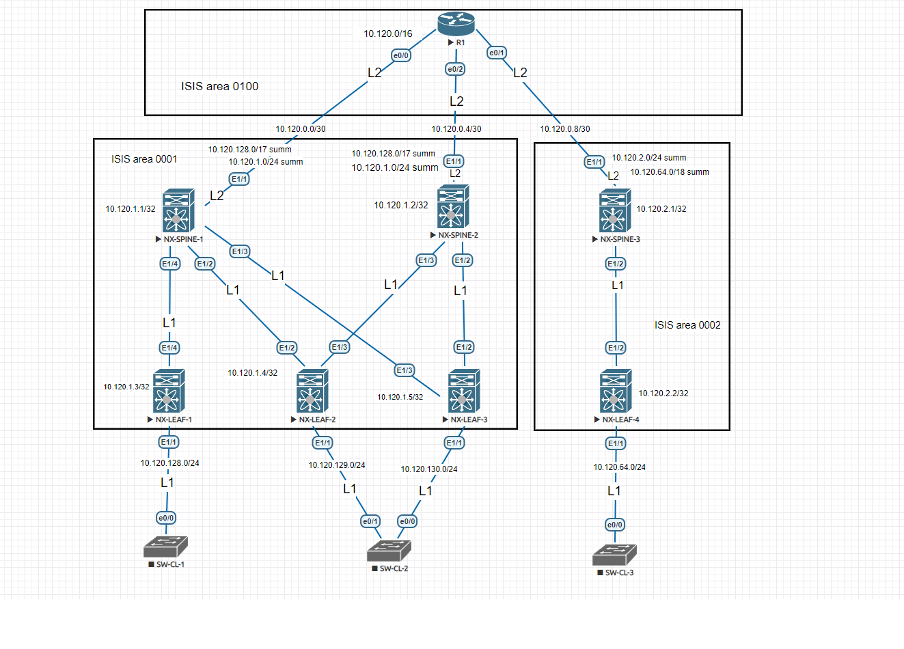

# Underlay ISIS

Адреса и сети в проекте:

| Пул ip адресов | Назначение | Маска сети |
| ------ | ------ | ------ |
| 10.120.0.0/16 | Общий пул ip адресов | /16 |
| 10.120.0.0/24 | P2p-соединения Spine - Core| /30 |
| 10.120.1.0/24 | Пул адресов Loopback-интерфейсов для unnumbered p2p-соединений Spile - Leaf ЦОД 1 | /31 |
| 10.120.2.0/24 | Пул адресов Loopback-интерфейсов для unnumbered p2p-соединений Spile - Leaf ЦОД 2 | /31 |
| 10.120.128.0/17 | Общий пул ip адресов для клиентских сетей на Leaf ЦОД 1 | /24 |
| 10.120.64.0/18 | Общий пул ip адресов для клиентских сетей на Leaf ЦОД 2 | /24 |

Распределение OSPF зон:

| Area № | Маршрутизаторы |
| ------ | ------ |
| 0100 | R1 (L2) |
| 0001 | NX-SPINE-1 (L1/L2) NX-SPINE-2 (L1/L2) NX-LEAF-1 (L1) NX-LEAF-2 (L1) NX-LEAF-3 (L1)|
| 0002 | NX-SPINE-3 (L1/L2) NX-LEAF-4 (L1) |

Cхема лабораторного стенда в Eve-NG:

Суммирование маршрутов:

| Area № | Маршрутизаторы | Маршрут |
| ------ | ------ | ------ |
| 0001 | NX-SPINE-1 NX-SPINE-2 | 10.120.1.0/24, 10.120.128.0/17 | 
| 0002 | NX-SPINE-3 | 10.120.2.0/24, 10.120.64.0/18 | 

Маршруты:

1. R1

  
show ip route

<pre><code>
      10.0.0.0/8 is variably subnetted, 10 subnets, 5 masks
C        10.120.0.0/30 is directly connected, Ethernet0/0
L        10.120.0.1/32 is directly connected, Ethernet0/0
C        10.120.0.4/30 is directly connected, Ethernet0/2
L        10.120.0.5/32 is directly connected, Ethernet0/2
C        10.120.0.8/30 is directly connected, Ethernet0/1
L        10.120.0.9/32 is directly connected, Ethernet0/1
i L2     10.120.1.0/24 [115/11] via 10.120.0.6, 01:23:54, Ethernet0/2
                       [115/11] via 10.120.0.2, 01:23:54, Ethernet0/0
i L2     10.120.2.0/24 [115/11] via 10.120.0.10, 00:13:33, Ethernet0/1
i L2     10.120.64.0/18 [115/73] via 10.120.0.10, 00:11:47, Ethernet0/1
i L2     10.120.128.0/17 [115/73] via 10.120.0.6, 06:47:37, Ethernet0/2
                         [115/73] via 10.120.0.2, 06:47:37, Ethernet0/0
</code></pre>

2. NX-SPINE-1

  
show ip route

<pre><code>
10.120.0.0/30, ubest/mbest: 1/0, attached
    *via 10.120.0.2, Eth1/1, [0/0], 10:48:31, direct
10.120.0.2/32, ubest/mbest: 1/0, attached
    *via 10.120.0.2, Eth1/1, [0/0], 10:48:32, local
10.120.0.4/30, ubest/mbest: 1/0
    *via 10.120.0.1, Eth1/1, [115/50], 06:57:25, isis-1, L2
10.120.0.8/30, ubest/mbest: 1/0
    *via 10.120.0.1, Eth1/1, [115/50], 06:57:25, isis-1, L2
10.120.1.0/24, ubest/mbest: 1/0
    *via Null0, [220/0], 07:24:33, isis-1, discard
10.120.1.1/32, ubest/mbest: 2/0, attached
    *via 10.120.1.1, Lo0, [0/0], 10:27:16, local
    *via 10.120.1.1, Lo0, [0/0], 10:27:16, direct
10.120.1.2/32, ubest/mbest: 2/0
    *via 10.120.1.4, Eth1/2, [115/81], 01:24:32, isis-1, L1
    *via 10.120.1.5, Eth1/3, [115/81], 01:24:32, isis-1, L1
10.120.1.3/32, ubest/mbest: 1/0
    *via 10.120.1.3, Eth1/4, [115/41], 08:27:36, isis-1, L1
10.120.1.4/32, ubest/mbest: 1/0
    *via 10.120.1.4, Eth1/2, [115/41], 08:18:11, isis-1, L1
10.120.1.5/32, ubest/mbest: 1/0
    *via 10.120.1.5, Eth1/3, [115/41], 07:30:51, isis-1, L1
10.120.2.0/24, ubest/mbest: 1/0
    *via 10.120.0.1, Eth1/1, [115/51], 00:14:11, isis-1, L2
10.120.64.0/18, ubest/mbest: 1/0
    *via 10.120.0.1, Eth1/1, [115/113], 00:12:24, isis-1, L2
10.120.128.0/17, ubest/mbest: 1/0
    *via Null0, [220/0], 06:49:26, isis-1, discard
10.120.128.0/24, ubest/mbest: 1/0
    *via 10.120.1.3, Eth1/4, [115/80], 08:27:36, isis-1, L1
10.120.129.0/24, ubest/mbest: 1/0
    *via 10.120.1.4, Eth1/2, [115/80], 08:18:11, isis-1, L1
10.120.130.0/24, ubest/mbest: 1/0
    *via 10.120.1.5, Eth1/3, [115/80], 07:30:51, isis-1, L1
</code></pre>

3. NX-SPINE-2

  
show ip route

<pre><code>
10.120.0.0/30, ubest/mbest: 1/0
    *via 10.120.0.5, Eth1/1, [115/50], 06:58:25, isis-1, L2
10.120.0.4/30, ubest/mbest: 1/0, attached
    *via 10.120.0.6, Eth1/1, [0/0], 07:12:37, direct
10.120.0.6/32, ubest/mbest: 1/0, attached
    *via 10.120.0.6, Eth1/1, [0/0], 07:12:37, local
10.120.0.8/30, ubest/mbest: 1/0
    *via 10.120.0.5, Eth1/1, [115/50], 06:58:51, isis-1, L2
10.120.1.0/24, ubest/mbest: 1/0
    *via Null0, [220/0], 07:24:14, isis-1, discard
10.120.1.1/32, ubest/mbest: 2/0
    *via 10.120.1.4, Eth1/3, [115/81], 01:25:25, isis-1, L1
    *via 10.120.1.5, Eth1/2, [115/81], 01:25:25, isis-1, L1
10.120.1.2/32, ubest/mbest: 2/0, attached
    *via 10.120.1.2, Lo0, [0/0], 10:23:30, local
    *via 10.120.1.2, Lo0, [0/0], 10:23:30, direct
10.120.1.3/32, ubest/mbest: 2/0
    *via 10.120.1.4, Eth1/3, [115/121], 01:25:25, isis-1, L1
    *via 10.120.1.5, Eth1/2, [115/121], 01:25:25, isis-1, L1
10.120.1.4/32, ubest/mbest: 1/0
    *via 10.120.1.4, Eth1/3, [115/41], 01:25:25, isis-1, L1
10.120.1.5/32, ubest/mbest: 1/0
    *via 10.120.1.5, Eth1/2, [115/41], 01:25:25, isis-1, L1
10.120.2.0/24, ubest/mbest: 1/0
    *via 10.120.0.5, Eth1/1, [115/51], 00:15:03, isis-1, L2
10.120.64.0/18, ubest/mbest: 1/0
    *via 10.120.0.5, Eth1/1, [115/113], 00:13:17, isis-1, L2
10.120.128.0/17, ubest/mbest: 1/0
    *via Null0, [220/0], 06:49:08, isis-1, discard
10.120.128.0/24, ubest/mbest: 2/0
    *via 10.120.1.4, Eth1/3, [115/160], 01:25:25, isis-1, L1
    *via 10.120.1.5, Eth1/2, [115/160], 01:25:25, isis-1, L1
10.120.129.0/24, ubest/mbest: 1/0
    *via 10.120.1.4, Eth1/3, [115/80], 01:25:25, isis-1, L1
10.120.130.0/24, ubest/mbest: 1/0
    *via 10.120.1.5, Eth1/2, [115/80], 01:25:25, isis-1, L1
</code></pre>

4. NX-SPINE-3

  
show ip route

<pre><code>
10.120.0.0/30, ubest/mbest: 1/0
    *via 10.120.0.9, Eth1/1, [115/50], 01:24:39, isis-1, L2
10.120.0.4/30, ubest/mbest: 1/0
    *via 10.120.0.9, Eth1/1, [115/50], 01:24:39, isis-1, L2
10.120.0.8/30, ubest/mbest: 1/0, attached
    *via 10.120.0.10, Eth1/1, [0/0], 10:45:35, direct
10.120.0.10/32, ubest/mbest: 1/0, attached
    *via 10.120.0.10, Eth1/1, [0/0], 10:45:35, local
10.120.1.0/24, ubest/mbest: 1/0
    *via 10.120.0.9, Eth1/1, [115/51], 01:24:38, isis-1, L2
10.120.2.0/24, ubest/mbest: 1/0
    *via Null0, [220/0], 00:16:28, isis-1, discard
10.120.2.1/32, ubest/mbest: 2/0, attached
    *via 10.120.2.1, Lo0, [0/0], 07:53:05, local
    *via 10.120.2.1, Lo0, [0/0], 07:53:05, direct
10.120.2.2/32, ubest/mbest: 1/0
    *via 10.120.2.2, Eth1/2, [115/80], 00:21:40, isis-1, L1
10.120.64.0/18, ubest/mbest: 1/0
    *via Null0, [220/0], 00:14:42, isis-1, discard
10.120.64.0/24, ubest/mbest: 1/0
    *via 10.120.2.2, Eth1/2, [115/80], 00:21:40, isis-1, L1
10.120.128.0/17, ubest/mbest: 1/0
    *via 10.120.0.9, Eth1/1, [115/113], 01:24:38, isis-1, L2
</code></pre>

5. NX-LEAF-1

  
show ip route

<pre><code>
0.0.0.0/0, ubest/mbest: 1/0
    *via 10.120.1.1, Eth1/4, [115/40], 07:01:07, isis-1, L1
10.120.0.0/30, ubest/mbest: 1/0
    *via 10.120.1.1, Eth1/4, [115/80], 08:31:19, isis-1, L1
10.120.0.4/30, ubest/mbest: 1/0
    *via 10.120.1.1, Eth1/4, [115/160], 07:01:41, isis-1, L1
10.120.1.1/32, ubest/mbest: 1/0
    *via 10.120.1.1, Eth1/4, [115/41], 07:31:08, isis-1, L1
10.120.1.2/32, ubest/mbest: 1/0
    *via 10.120.1.1, Eth1/4, [115/121], 01:28:14, isis-1, L1
10.120.1.3/32, ubest/mbest: 2/0, attached
    *via 10.120.1.3, Lo0, [0/0], 10:23:04, local
    *via 10.120.1.3, Lo0, [0/0], 10:23:04, direct
10.120.1.4/32, ubest/mbest: 1/0
    *via 10.120.1.1, Eth1/4, [115/81], 08:21:54, isis-1, L1
10.120.1.5/32, ubest/mbest: 1/0
    *via 10.120.1.1, Eth1/4, [115/81], 07:34:34, isis-1, L1
10.120.128.0/24, ubest/mbest: 1/0, attached
    *via 10.120.128.1, Eth1/1, [0/0], 08:36:09, direct
10.120.128.1/32, ubest/mbest: 1/0, attached
    *via 10.120.128.1, Eth1/1, [0/0], 08:36:09, local
10.120.129.0/24, ubest/mbest: 1/0
    *via 10.120.1.1, Eth1/4, [115/120], 08:21:54, isis-1, L1
10.120.130.0/24, ubest/mbest: 1/0
    *via 10.120.1.1, Eth1/4, [115/120], 07:34:34, isis-1, L1
</code></pre>

6. NX-LEAF-2

  
show ip route

<pre><code>
0.0.0.0/0, ubest/mbest: 2/0
    *via 10.120.1.1, Eth1/2, [115/40], 07:02:00, isis-1, L1
    *via 10.120.1.2, Eth1/3, [115/40], 07:03:03, isis-1, L1
10.120.0.0/30, ubest/mbest: 1/0
    *via 10.120.1.1, Eth1/2, [115/80], 08:22:47, isis-1, L1
10.120.0.4/30, ubest/mbest: 1/0
    *via 10.120.1.2, Eth1/3, [115/80], 07:02:34, isis-1, L1
10.120.1.1/32, ubest/mbest: 1/0
    *via 10.120.1.1, Eth1/2, [115/41], 07:32:01, isis-1, L1
10.120.1.2/32, ubest/mbest: 1/0
    *via 10.120.1.2, Eth1/3, [115/41], 01:29:07, isis-1, L1
10.120.1.3/32, ubest/mbest: 1/0
    *via 10.120.1.1, Eth1/2, [115/81], 08:22:46, isis-1, L1
10.120.1.4/32, ubest/mbest: 2/0, attached
    *via 10.120.1.4, Lo0, [0/0], 10:00:56, local
    *via 10.120.1.4, Lo0, [0/0], 10:00:56, direct
10.120.1.5/32, ubest/mbest: 2/0
    *via 10.120.1.1, Eth1/2, [115/81], 07:35:27, isis-1, L1
    *via 10.120.1.2, Eth1/3, [115/81], 07:35:20, isis-1, L1
10.120.128.0/24, ubest/mbest: 1/0
    *via 10.120.1.1, Eth1/2, [115/120], 08:22:46, isis-1, L1
10.120.129.0/24, ubest/mbest: 1/0, attached
    *via 10.120.129.1, Eth1/1, [0/0], 08:24:10, direct
10.120.129.1/32, ubest/mbest: 1/0, attached
    *via 10.120.129.1, Eth1/1, [0/0], 08:24:10, local
10.120.130.0/24, ubest/mbest: 2/0
    *via 10.120.1.1, Eth1/2, [115/120], 07:35:27, isis-1, L1
    *via 10.120.1.2, Eth1/3, [115/120], 07:35:20, isis-1, L1
</code></pre>

7. NX-LEAF-3

  
show ip route

<pre><code>
0.0.0.0/0, ubest/mbest: 2/0
    *via 10.120.1.1, Eth1/3, [115/40], 07:02:57, isis-1, L1
    *via 10.120.1.2, Eth1/2, [115/40], 07:04:00, isis-1, L1
10.120.0.0/30, ubest/mbest: 1/0
    *via 10.120.1.1, Eth1/3, [115/80], 07:36:24, isis-1, L1
10.120.0.4/30, ubest/mbest: 1/0
    *via 10.120.1.2, Eth1/2, [115/80], 07:03:31, isis-1, L1
10.120.1.1/32, ubest/mbest: 1/0
    *via 10.120.1.1, Eth1/3, [115/41], 07:32:57, isis-1, L1
10.120.1.2/32, ubest/mbest: 1/0
    *via 10.120.1.2, Eth1/2, [115/41], 01:30:04, isis-1, L1
10.120.1.3/32, ubest/mbest: 1/0
    *via 10.120.1.1, Eth1/3, [115/81], 07:36:23, isis-1, L1
10.120.1.4/32, ubest/mbest: 2/0
    *via 10.120.1.1, Eth1/3, [115/81], 07:36:23, isis-1, L1
    *via 10.120.1.2, Eth1/2, [115/81], 07:36:16, isis-1, L1
10.120.1.5/32, ubest/mbest: 2/0, attached
    *via 10.120.1.5, Lo0, [0/0], 09:52:24, local
    *via 10.120.1.5, Lo0, [0/0], 09:52:24, direct
10.120.128.0/24, ubest/mbest: 1/0
    *via 10.120.1.1, Eth1/3, [115/120], 07:36:23, isis-1, L1
10.120.129.0/24, ubest/mbest: 2/0
    *via 10.120.1.1, Eth1/3, [115/120], 07:36:23, isis-1, L1
    *via 10.120.1.2, Eth1/2, [115/120], 07:36:16, isis-1, L1
10.120.130.0/24, ubest/mbest: 1/0, attached
    *via 10.120.130.1, Eth1/1, [0/0], 07:38:06, direct
10.120.130.1/32, ubest/mbest: 1/0, attached
    *via 10.120.130.1, Eth1/1, [0/0], 07:38:06, local
</code></pre>

8. NX-LEAF-4

  
show ip route

<pre><code>
0.0.0.0/0, ubest/mbest: 1/0
    *via 10.120.2.1, Eth1/2, [115/40], 00:25:44, isis-1, L1
10.120.0.8/30, ubest/mbest: 1/0
    *via 10.120.2.1, Eth1/2, [115/80], 00:25:44, isis-1, L1
10.120.2.1/32, ubest/mbest: 1/0
    *via 10.120.2.1, Eth1/2, [115/41], 00:20:40, isis-1, L1
10.120.2.2/32, ubest/mbest: 2/0, attached
    *via 10.120.2.2, Lo0, [0/0], 00:45:15, local
    *via 10.120.2.2, Lo0, [0/0], 00:45:15, direct
10.120.64.0/24, ubest/mbest: 1/0, attached
    *via 10.120.64.1, Eth1/1, [0/0], 00:44:38, direct
10.120.64.1/32, ubest/mbest: 1/0, attached
    *via 10.120.64.1, Eth1/1, [0/0], 00:44:38, local
</code></pre>

Шпаргалка:

ISIS 

net 49.0001.0000.0000.0017.00
   AFI|Area|    NODE ID   |NSEL 