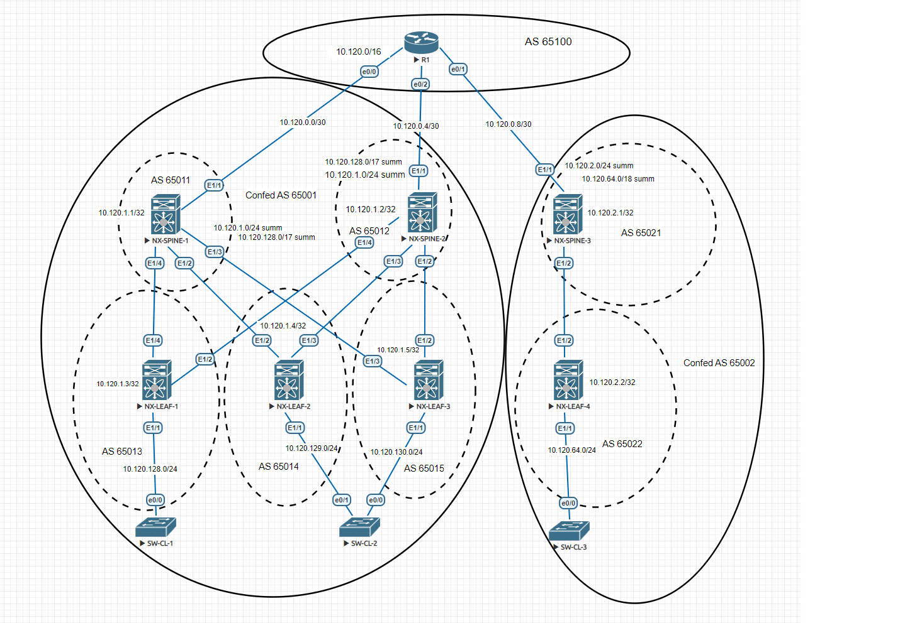

# Underlay BGP

Адреса и сети в проекте:

| Пул ip адресов | Назначение | Маска сети |
| ------ | ------ | ------ |
| 10.120.0.0/16 | Общий пул ip адресов | /16 |
| 10.120.0.0/24 | P2p-соединения Spine - Core| /30 |
| 10.120.1.0/24 | Пул адресов Loopback-интерфейсов для unnumbered p2p-соединений Spile - Leaf ЦОД 1 | /31 |
| 10.120.2.0/24 | Пул адресов Loopback-интерфейсов для unnumbered p2p-соединений Spile - Leaf ЦОД 2 | /31 |
| 10.120.128.0/17 | Общий пул ip адресов для клиентских сетей на Leaf ЦОД 1 | /24 |
| 10.120.64.0/18 | Общий пул ip адресов для клиентских сетей на Leaf ЦОД 2 | /24 |

Для использования ip unnumbered интерфейсов в проекте оставляем для каждого ЦОД-а IGP

Распределение ISIS зон:

| Area № | Маршрутизаторы |
| ------ | ------ |
| 0001 | NX-SPINE-1 (L1) NX-SPINE-2 (L1) NX-LEAF-1 (L1) NX-LEAF-2 (L1) NX-LEAF-3 (L1)|
| 0002 | NX-SPINE-3 (L1/L2) NX-LEAF-4 (L1) |

Для назначения каждому ЦОД-у по одному номеру AS используем конфедерации BGP

Cхема лабораторного стенда в Eve-NG:

Автономные системы BGP:

| ЦОД | ID Конфедерации | AS | Маршрутизаторы | Маршрут |
| ------ | ------ | ------ | ------ | ------ |
| - | - | 65100 | R1 | 10.120.0.0/24 | 
| 1 | 65001 | 65011 | NX-SPINE-1 | 10.120.1.0/24, 10.120.128.0/17 | 
| 1 | 65001 | 65012 | NX-SPINE-2 | 10.120.1.0/24, 10.120.128.0/17 | 
| 1 | 65001 | 65013 | NX-LEAF-1 | 10.120.128.0/24 
| 1 | 65001 | 65014 | NX-LEAF-2 | 10.120.129.0/24
| 1 | 65001 | 65015 | NX-LEAF-3 | 10.120.130.0/24
| 2 | 65002 | 65021 | NX-SPINE-3 | 10.120.2.0/24, 10.120.64.0/18 | 
| 2 | 65002 | 65022 | NX-LEAF-4 | 10.120.64.0/24 |

Суммирование маршрутов:

| AS | Маршрутизаторы | Маршрут |
| ------ | ------ | ------ |
| 65001 | NX-SPINE-1 NX-SPINE-2 | 10.120.1.0/24, 10.120.128.0/17 | 
| 65002 | NX-SPINE-3 | 10.120.2.0/24, 10.120.64.0/18 | 

Типовые конфигурации:

  
Конфигурация SPINE

<pre><code>
#Loopback-интерфейс

interface loopback0
  ip address 10.120.1.1/32

#Интерфейс к R1

interface Ethernet1/1
  no switchport
  ip address 10.120.0.2/30
  no shutdown

#Интерфейс к LEAF

interface Ethernet1/2
  no switchport
  mtu 9216
  medium p2p
  ip unnumbered loopback0
  no isis hello-padding always
  isis network point-to-point
  isis circuit-type level-1
  ip router isis 1
  no shutdown

#Настройка IGP ISIS  

router isis 1
  net 49.0001.0101.2000.1001.00
  is-type level-1
  metric-style transition
  address-family ipv4 unicast
    router-id loopback0
    advertise interface loopback0 level-1

#Настройка BGP  	

router bgp 65011
  confederation identifier 65001
  confederation peers 65013 65014 65015
  address-family ipv4 unicast
    aggregate-address 10.120.1.0/24 summary-only
    aggregate-address 10.120.128.0/17 summary-only
    maximum-paths 2
  neighbor 10.120.0.1
    remote-as 65100
    address-family ipv4 unicast
  neighbor 10.120.1.3
    remote-as 65013
    address-family ipv4 unicast
  neighbor 10.120.1.4
    remote-as 65014
    address-family ipv4 unicast
  neighbor 10.120.1.5
    remote-as 65015
    address-family ipv4 unicast
</code></pre>

  
Конфигурация LEAF

<pre><code>
#Loopback-интерфейс

interface loopback0
  ip address 10.120.1.4/32

#Интерфейс к клиентам

interface Ethernet1/1
  no switchport
  ip address 10.120.129.1/24
  no shutdown

#Интерфейс к SPINE

interface Ethernet1/2
  no switchport
  mtu 9216
  medium p2p
  ip unnumbered loopback0
  no isis hello-padding always
  ip router isis 1
  no shutdown

#Настройка ISIS

router isis 1
  net 49.0001.0101.2000.1004.00
  is-type level-1
  metric-style transition
  address-family ipv4 unicast
    router-id loopback0
    advertise interface loopback0 level-1

#Настройка BGP

router bgp 65014
  confederation identifier 65001
  confederation peers 65011 65012
  address-family ipv4 unicast
    network 10.120.129.0/24
    maximum-paths 2
  neighbor 10.120.1.1
    remote-as 65011
    address-family ipv4 unicast
  neighbor 10.120.1.2
    remote-as 65012
    address-family ipv4 unicast
</code></pre>

