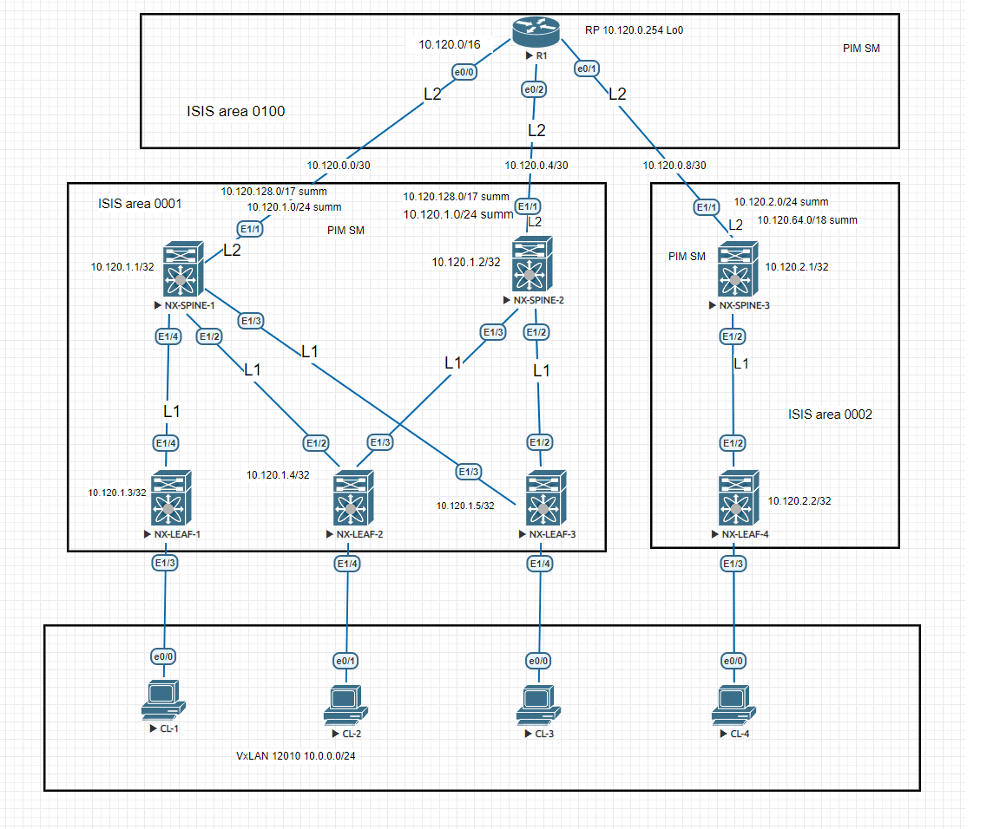

# 05 Underlay IS-IS PiM-SM cl vxlan 10.0.0.0/24

На устройствах R1, NX-SPINE и NX-LEAF включен PiM-SM

RP - Loopback-интерфейс на R1 10.120.0.254

IGP - протокол - ISIS взят из старой работы.

Cхема лабораторного стенда в Eve-NG:

Типовые конфигурации:

  
Конфигурация SPINE

<pre><code>
# Features

feature pim
feature isis

# PiM-SM

ip pim rp-address 10.120.0.254 group-list 224.0.0.0/4
ip pim ssm range 232.0.0.0/8

#Loopback-интерфейс

interface loopback0
  ip address 10.120.1.1/32
  ip pim sparse-mode

#Интерфейс к R1

interface Ethernet1/1
  no switchport
  ip address 10.120.0.2/30
  isis network point-to-point
  isis circuit-type level-2
  ip router isis 1
  ip pim sparse-mode
  no shutdown

#Интерфейс к LEAF

interface Ethernet1/2
  no switchport
  mtu 9216
  medium p2p
  ip unnumbered loopback0
  no isis hello-padding always
  isis network point-to-point
  isis circuit-type level-1
  ip router isis 1
  ip pim sparse-mode
  no shutdown

#Настройка ISIS  

router isis 1
  net 49.0001.0101.2000.1001.00
  metric-style transition
  address-family ipv4 unicast
    distribute level-1 into level-2 all
    summary-address 10.120.1.0/24 level-2
    summary-address 10.120.128.0/17 level-2
    router-id loopback0
    advertise interface loopback0 level-1
</code></pre>

  
Конфигурация LEAF

<pre><code>
# Features

feature pim
feature isis
feature vn-segment-vlan-based
feature nv overlay

# PiM-SM

ip pim rp-address 10.120.0.254 group-list 224.0.0.0/4
ip pim ssm range 232.0.0.0/8

#VLAN к клиенту

vlan 1,10
vlan 10
  vn-segment 12010
  
#VxLAN

interface nve1
  no shutdown
  source-interface loopback0
  member vni 12010 mcast-group 239.0.0.10

#Loopback-интерфейс

interface loopback0
  ip address 10.120.1.4/32
   ip pim sparse-mode

#Интерфейс к клиентам

interface Ethernet1/3
  switchport access vlan 10

#Интерфейс к SPINE

interface Ethernet1/2
  no switchport
  mtu 9216
  medium p2p
  ip unnumbered loopback0
  no isis hello-padding always
  ip router isis 1
  ip pim sparse-mode
  no shutdown

#Настройка ISIS

router isis 1
  net 49.0001.0101.2000.1004.00
  is-type level-1
  metric-style transition
  address-family ipv4 unicast
	router-id loopback0
    advertise interface loopback0 level-1
</code></pre>

Пинг между клиентами:

CL-1#ping 10.0.0.4
Type escape sequence to abort.
Sending 5, 100-byte ICMP Echos to 10.0.0.4, timeout is 2 seconds:
!!!!!
Success rate is 100 percent (5/5), round-trip min/avg/max = 112/257/497 ms
CL-1#

