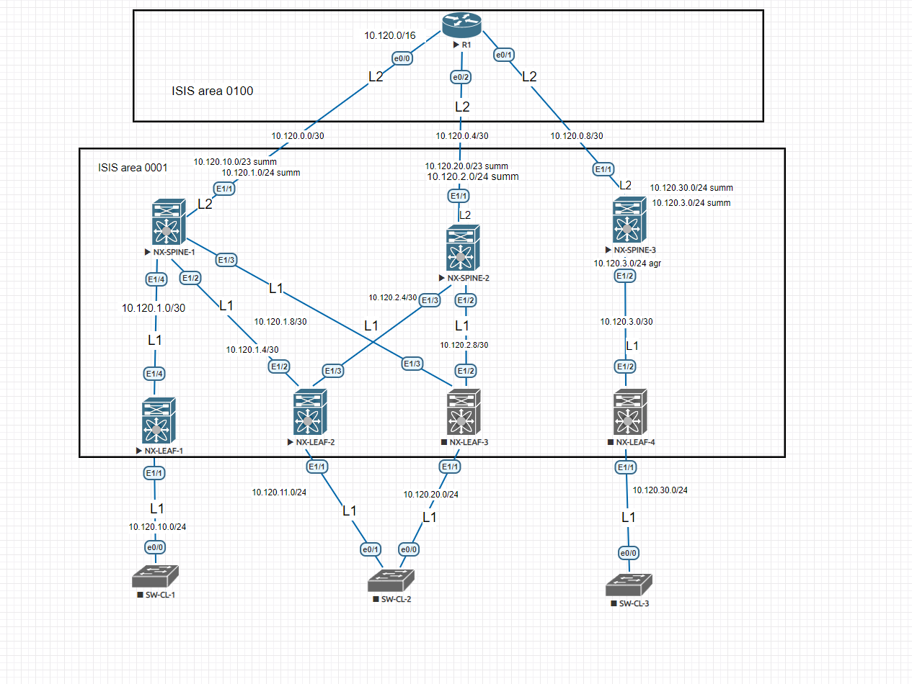

Cхема лабораторного стенда в Eve-NG:

R1#show ip route
      10.0.0.0/8 is variably subnetted, 12 subnets, 4 masks
C        10.120.0.0/30 is directly connected, Ethernet0/0
L        10.120.0.1/32 is directly connected, Ethernet0/0
C        10.120.0.4/30 is directly connected, Ethernet0/2
L        10.120.0.5/32 is directly connected, Ethernet0/2
C        10.120.0.8/30 is directly connected, Ethernet0/1
L        10.120.0.9/32 is directly connected, Ethernet0/1
i L2     10.120.1.0/24 [115/50] via 10.120.0.2, 03:39:33, Ethernet0/0
i L2     10.120.2.0/24 [115/50] via 10.120.0.6, 03:39:33, Ethernet0/2
i L2     10.120.3.0/24 [115/50] via 10.120.0.10, 03:39:33, Ethernet0/1
i L2     10.120.10.0/23 [115/73] via 10.120.0.6, 00:04:25, Ethernet0/2
                        [115/73] via 10.120.0.2, 00:04:25, Ethernet0/0
i L2     10.120.20.0/23 [115/73] via 10.120.0.6, 00:05:26, Ethernet0/2
                        [115/73] via 10.120.0.2, 00:05:26, Ethernet0/0
i L2     10.120.30.0/23 [115/73] via 10.120.0.10, 00:00:36, Ethernet0/1

Шпаргалка:

ISIS 

net 49.0001.0000.0000.0017.00
   AFI|Area|    NODE ID   |NSEL 